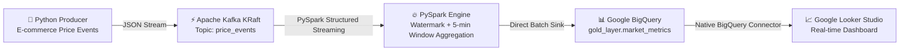

# RetailStream 🛒⚡

**RetailStream** is a real-time e-commerce data engineering pipeline designed to ingest, process, and analyze streaming market price volatility and inventory metrics across competing retailers.

It uses a modern **Streamhouse / Medallion Architecture** pattern: ingesting event data with Apache Kafka, transforming and aggregating streaming windows with PySpark Structured Streaming (with state watermarking), sinking directly into Google BigQuery, and visualizing metrics live in **Google Looker Studio**.

---

## 🏗️ Data Architecture



---

## 🛠️ Data Pipeline Layers

| Layer | Technology | Description |
| :--- | :--- | :--- |
| **Ingestion** | Apache Kafka (KRaft mode) | Zookeeper-less single-node broker (`confluentinc/cp-kafka:7.4.0`) |
| **Producer** | Python (`confluent-kafka`) | Simulates realistic price volatility, flash sales, and inventory fluctuations partitioned by SKU `product_id` |
| **Processing** | PySpark Structured Streaming | Parses JSON payload, applies `10-min` state watermark, computes `5-min` tumbling window metrics (`min_price`, `max_price`, `avg_price`, `min_stock`, `max_stock`, `avg_stock`), and flattens timestamps (`window_start`, `window_end`) |
| **Storage / Sink** | Google BigQuery | Gold layer analytical table (`gold_layer.market_metrics`) |
| **Visualization** | Google Looker Studio | Interactive real-time analytics dashboard |

---

## 🚀 Quickstart Guide

### 1. Prerequisites
- Docker & Docker Compose
- Python 3.9+
- Java 8+ / 11 (required for PySpark)
- GCP Service Account JSON key with BigQuery Data Editor permissions

### 2. Environment Configuration
Create or update `.env` in the project root:
```bash
GOOGLE_APPLICATION_CREDENTIALS=/path/to/your/gcp-service-account-key.json
KAFKA_BOOTSTRAP_SERVERS=localhost:9092
KAFKA_TOPIC=price_events
BIGQUERY_TABLE=your_project_id.gold_layer.market_metrics
```

### 3. Start Apache Kafka (Docker KRaft)
```bash
docker-compose up -d
```

### 4. Start PySpark Streaming Processor
```bash
python spark_processor.py
```

### 5. Start Event Producer (in a separate terminal)
```bash
python producer.py
```

---

## 📊 Google Looker Studio Dashboard Setup Guide

You can connect **Google Looker Studio** directly to BigQuery in under 2 minutes:

### Step 1: Connect Data Source
1. Open [Google Looker Studio](https://lookerstudio.google.com/).
2. Click **Create** $\rightarrow$ **Data Source**.
3. Select the **BigQuery** connector.
4. Pick your GCP Project $\rightarrow$ `gold_layer` dataset $\rightarrow$ `market_metrics` table.
5. Click **Connect**.

### Step 2: Set Dimension & Timestamp Types
- Ensure `window_start` and `window_end` are recognized as **Date & Time (`YYYYMMDDHHMMSS`)**.
- Ensure `product_id` is set to **Text**.
- Ensure `avg_price`, `min_price`, `max_price`, `avg_stock`, `min_stock` are **Numeric / Currency**.

### Step 3: Recommended Dashboard Widgets

1. **Scorecards (Key Metrics)**:
   - **Active SKUs Tracked**: Metric = `COUNT_DISTINCT(product_id)`
   - **Overall Avg Price**: Metric = `AVG(avg_price)`
   - **Min Stock Level**: Metric = `MIN(min_stock)`

2. **Price Trend Chart (Time-Series Line Chart)**:
   - **Dimension**: `window_start`
   - **Breakdown Dimension**: `product_id`
   - **Metric**: `AVG(avg_price)`

3. **Price Volatility Spread (Bar Chart)**:
   - **Dimension**: `product_id`
   - **Calculated Metric**: `max_price - min_price` (Price Spread)

4. **Inventory Alert Table**:
   - **Dimensions**: `product_id`, `window_start`
   - **Metrics**: `min_stock`, `avg_stock`
   - **Filter**: `min_stock < 15` (Low Stock Alert)